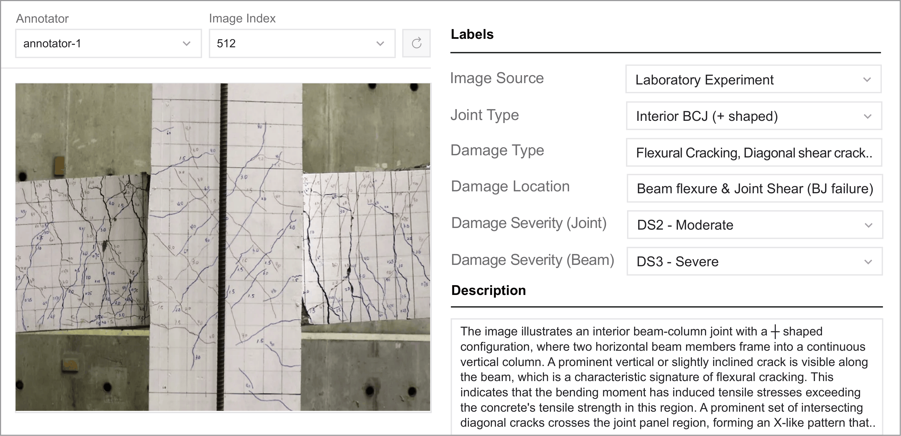

# RC-BCJ-Dataset: A Benchmark Image Dataset of Reinforced Concrete Beam–Column Joint Failures

[](https://creativecommons.org/licenses/by-nc/4.0/)
[](https://doi.org/10.5281/zenodo.link)

A curated benchmark dataset of **572 annotated images** of reinforced concrete (RC) beam–column joint failures, with expert-verified multi-attribute annotations for structural damage recognition, vision–language modeling, and generative modeling in structural engineering.

<p align="center">
  
  <br>
  Figure 1. Web-based annotation interface used for structured categorical labeling and free-text diagnostic description entry.
</p>

---

## Table of Contents

- [Overview](#overview)
- [Dataset Statistics](#dataset-statistics)
- [Annotation Taxonomy](#annotation-taxonomy)
- [Data Sources](#data-sources)
- [Annotation Process](#annotation-process)
- [Repository Structure](#repository-structure)
- [Data Records](#data-records)
- [Baseline Experiments](#baseline-experiments)
- [Getting Started](#getting-started)
- [Citation](#citation)
- [License](#license)

---

## Overview

Reinforced concrete (RC) beam–column joints are critical structural components in moment-resisting frame systems. Under seismic or extreme loading, inelastic deformations and cracking localize within the joint core or adjacent beam regions. The spatial distribution and morphology of these cracks constitute important visual evidence for diagnosing governing failure mechanisms — including beam-dominated (B), joint shear (J), and combined beam–joint (BJ) failures.

Despite their importance in structural assessment and post-earthquake inspection, publicly available visual datasets specifically dedicated to RC beam–column joint failures, with structured annotations suitable for computer vision and multimodal learning, remain limited. This dataset addresses that gap by providing:

- **572 beam–column joint images** (PNG format) from both laboratory experiments and field/web-collected sources
- **Multi-attribute categorical annotations** covering joint type, failure mechanism, damage type, and damage severity
- **1,716 expert-written image–text diagnostic description pairs** (three independent descriptions per image)
- **Segmentation masks** delineating background, beam, column, and joint-core regions for all images
- **Predefined train–test splits** and baseline benchmark results for reproducible evaluation

The dataset supports a range of research tasks, including supervised failure-mode classification, damage-type recognition, severity estimation, image-to-text diagnostic report generation, text-conditioned image generation, and multimodal representation learning.

## Dataset Statistics

| Property | Value |
|---|---|
| Total images | 572 |
| Image format | PNG |
| Annotation format | JSON |
| Categorical annotation entries (minimum) | 2,860 |
| Image–text description pairs | 1,716 |
| Descriptions per image | 3 (one per annotator) |
| Annotators | 3 structural engineering specialists |
| Segmentation masks provided | Yes (all 572 images) |
| Source domains | Laboratory specimens; field / web-collected |

---

## Annotation Taxonomy

Each image is associated with the following structured annotation fields. All categorical labels are determined by majority voting across three independent annotators, with disagreements resolved by an independent reviewer.

### Joint Type (`joint_type`)

| Category | Description |
|---|---|
| Interior BCJ (+ shaped) | Cross-shaped interior joint configuration |
| Interior BCJ (T shaped, top floor) | Interior T-type joint configuration |
| Exterior BCJ (inverted T-shaped) | Exterior T-type joint configuration |
| Exterior BCJ (L-shaped, top floor) | Corner-type joint configuration |

### Failure Mechanism (`failure_mechanism`)

| Category | Description |
|---|---|
| Joint shear (J failure) | Shear-dominated failure within the joint core |
| Beam flexure near joint (B failure) | Flexural failure at the beam end region |
| Beam & joint shear (BJ failure) | Combined flexural and joint shear failure |

### Damage Type (`damage_type`)

Multiple labels may be assigned per image.

| Category | Description |
|---|---|
| Flexural cracking | Cracks caused by bending action |
| Diagonal shear cracking | Inclined cracks due to shear stress |
| Concrete spalling | Surface concrete detachment |
| Concrete crushing | Localized compressive failure of concrete |
| Rebar exposure | Reinforcement visibly exposed |

### Damage Severity (`damage_severity`)

Severity levels are defined for this dataset and are conceptually aligned with the progressive damage descriptions used in HAZUS and EMS-98. Separate severity labels are assigned for the joint region and the beam region.

| Level | Label | Description |
|---|---|---|
| DS0 | No visible damage | No observable structural damage |
| DS1 | Minor | Slight cracking without structural compromise |
| DS2 | Moderate | Noticeable cracking and localized deterioration |
| DS3 | Severe | Significant damage affecting structural integrity |
| DS4 | Near collapse | Critical damage approaching structural failure |

### Source Domain (`source_domain`)

| Category | Description |
|---|---|
| Experimental specimen (laboratory) | Controlled laboratory testing environment |
| Real building (field / web-collected) | Images from in-service structures |

### Diagnostic Description (`description`)

Each image is accompanied by three independent free-text structural diagnostic narratives, one per annotator. These descriptions capture expert observations that may not be fully represented by discrete categorical fields. All three descriptions are retained in the dataset to preserve different expert perspectives and wording styles.

---

## Data Sources

Images were collected from two primary source types:

**Experimental literature.** A subset of images originates from published experimental studies on RC and precast concrete (PC) beam–column joints tested under controlled loading conditions (reversed cyclic or quasi-static lateral loading). These studies investigated parameters including concrete compressive strength, reinforcement yield strength, beam and column dimensions, joint configuration, anchorage details, confinement reinforcement, and connection type. Associated visual records documented flexural cracking, diagonal shear cracking, concrete spalling, crushing, and reinforcement exposure.

**Web and document sources.** Additional images were collected from publicly available structural technical reports, educational materials, laboratory-related documents, and web-based research resources. This collection strategy ensures the dataset includes both parameter-associated experimental samples and more diverse visual examples of beam–column joint damage.

---

## Annotation Process

Three structural engineering specialists, each with more than 10 years of professional or academic experience, independently annotated all images using a dedicated web-based annotation platform with real-time saving and editing capabilities. Each annotator completed their session independently to prevent mutual influence.

**Categorical fields.** A single representative label was produced for each structured field per image via majority voting. In cases of substantial disagreement among annotators, an independent reviewer examined the original image and all three annotator labels before assigning a final decision. This procedure yields one consolidated label per structured field while reducing individual annotation bias.

**Diagnostic descriptions.** Each annotator provided an independent free-text diagnostic description for each image. Unlike categorical fields, descriptions were not merged; all three expert-written descriptions are retained in the dataset to reflect diverse expert viewpoints and structural interpretations.

**Spatial annotations.** Pixel-level segmentation masks indicating background, beam, column, and joint-core regions are provided for all images.

---

## Repository Structure

```
RC-BCJ-Damage-Dataset/
├── images/                          # Beam–column joint images (.png)
│   ├── sample_001.png
│   ├── sample_002.png
│   └── ...
├── masks/                           # Segmentation mask images (.png)
│   ├── sample_001.png
│   ├── sample_002.png
│   └── ...
├── annotations/
│   ├── annotations_consensus.json   # Consensus labels (one per structured field per image)
│   ├── annotations_annotator_01.json
│   ├── annotations_annotator_02.json
│   └── annotations_annotator_03.json
├── metadata/
│   └── structural_parameters.csv   # Structural and material parameters for experimental specimens
└── README.md
```

---

## Data Records

### Images and Masks

All images are stored in `/images/` as `sample_XXX.png`. Corresponding segmentation masks are stored in `/masks/` using the same file name. Each image is assigned a unique `image_id` following the `sample_XXX` naming convention. All dataset components are linked through this common `image_id` field.

Segmentation masks encode four region classes: background, beam, column, and joint core.

### Annotation Files

All annotation files are stored in `/annotations/`.

**`annotations_consensus.json`** — The primary annotation file for standard supervised learning tasks. Provides one consolidated label per structured field per image, including `joint_type`, `damage_type`, `damage_location`, `damage_severity_joint`, and `damage_severity_beam`. Consensus labels are recommended for failure-mode classification, damage-type recognition, and severity estimation benchmarks.

**`annotations_annotator_0{1,2,3}.json`** — Individual annotator files preserving each annotator's original field selections and expert-written diagnostic descriptions prior to consensus aggregation. These files are particularly suited for image-to-text generation and multimodal learning tasks, as each diagnostic description is directly paired with the field labels selected by the same annotator.

All annotation files use JSON for structured, machine-readable representation that can be parsed programmatically and loaded directly into machine learning pipelines.

### Structural Parameters

`/metadata/structural_parameters.csv` provides structural and material parameters associated with experimental specimens (e.g., concrete compressive strength, reinforcement properties, member dimensions) for the subset of images sourced from the experimental literature.

---

## Baseline Experiments

The following baseline results are provided to demonstrate the technical usability of the dataset across representative tasks. Full experimental details are reported in the accompanying paper.

### Failure-Mode Classification

Three-class classification (B / J / BJ failure mechanism) evaluated with 10-fold cross-validation.

| Model | Accuracy | F1 | AUC |
|---|---|---|---|
| ResNet-50 | 69.28 | **67.05** | 85.99 |
| EfficientNet-B0 | 69.06 | 60.15 | 87.52 |
| EfficientNet-V2-S | 70.13 | 64.88 | 86.64 |
| ViT-B/16 | **70.30** | 63.25 | **89.19** |
| Swin-T | 69.77 | 64.43 | 88.80 |
| DINOv2 | 62.96 | 58.34 | 84.15 |
| DINOv3 | 59.10 | 61.59 | 81.20 |


### Image-to-Text Diagnostic Description Generation

Evaluated on BLEU-4, METEOR, and ROUGE-L against expert-written reference descriptions.

| Model | BLEU-4 | METEOR | ROUGE-L |
|---|---|---|---|
| Gemma-3-4B | **0.449** | 0.684 | 0.604 |
| Qwen3-VL-4B | 0.431 | **0.688** | 0.596 |
| R2Gen | 0.355 | 0.476 | 0.565 |

### Text-Conditioned Image Generation

Baseline results for text-conditioned image generation are reported in the accompanying paper.

---

## Getting Started

### Clone the Repository

```bash
git clone https://github.com/nubcico/rc-bcj-dataset
cd rc-bcj-dataset
pip install -r requirements.txt
```

### Load Annotations

```python
import json
import pandas as pd

# Load consensus annotations
with open("annotations/annotations_consensus.json", "r") as f:
    annotations = json.load(f)

# Load structural metadata
meta = pd.read_csv("metadata/structural_parameters.csv")
print(meta.head())
```

### Access Individual Annotator Records

```python
# Load annotator-specific labels and diagnostic descriptions
with open("annotations/annotations_annotator_01.json", "r") as f:
    annotator_01 = json.load(f)
```

### Train 3-class Failure Mechanism classification: Beam, Beam-Joint, Joint using Stratified 10-fold Cross-Validation

```python
python classifier.py
```

### Train Downstream Task: Joint Type Classification

```python
python classifier_downstream_joint_type.py
```

### Vision-Language Model (VLM) Fine-tuning

```python
python VLM_finetune.py
```

---

## Citation

If you use this dataset in your research, please cite:

```bibtex
@article{,
  title   = {A Benchmark Image Dataset of Reinforced Concrete Beam--Column Joint Failures},
  author  = {Lee, Min-Ho and Abdrakhmanov, Azimzhan and Atlassov, Vadim and
             Schlattner, Isabella and Kim, Dong-Ho and Ju, Hyun-Jin},
  journal = {},
  year    = {},
  doi     = {}
}
```

---

## Authors

- Min-Ho Lee — Department of Computer Science, Nazarbayev University, Astana, Kazakhstan
- Azimzhan Abdrakhmanov — Department of Computer Science, Nazarbayev University, Astana, Kazakhstan
- Vadim Atlassov — Department of Computer Science, Nazarbayev University, Astana, Kazakhstan
- Isabella Schlattner — Department of Computer Science, Nazarbayev University, Astana, Kazakhstan
- Dong-Ho Kim — Department of Architecture and Architectural Engineering, Hankyong National University, Republic of Korea
- Hyun-Jin Ju *(Corresponding author: hju@hknu.ac.kr)* — Department of Architecture and Architectural Engineering, Hankyong National University, Republic of Korea

---

## License

This dataset is released under the [Creative Commons Attribution–NonCommercial 4.0 International (CC BY-NC 4.0)](https://creativecommons.org/licenses/by-nc/4.0/) license. It is freely available for academic and non-commercial research use. Commercial use is prohibited.
